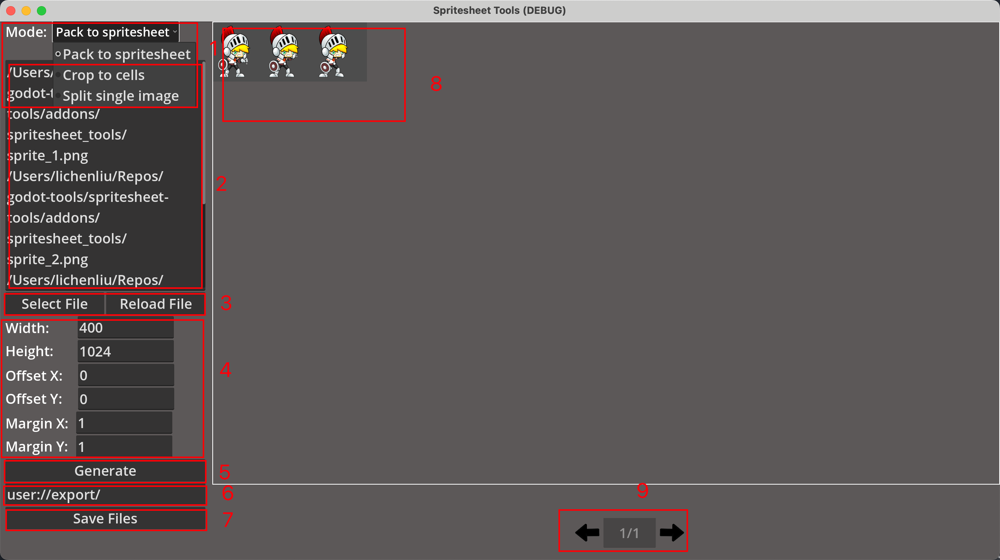

# Spritesheet Tool

A single-scene utility designed for creating and managing spritesheets and individual images.

## Overview

The **Spritesheet Tool** provides efficient and customizable workflows for spritesheet creation and manipulation. It supports three primary functions:

1. **Pack to Spritesheet**: Combines multiple images into one spritesheet with configurable parameters such as dimensions, offsets, and margins.
2. **Crop to Cells**: Splits a large spritesheet into evenly sized cells, allowing for adjustments in cell size, margins, and offsets.
3. **Split Single Image**: Allows users to extract a specific region of an image by clicking and dragging over the desired area.

The tool features a user-friendly interface, including options to select files, configure settings, preview results, and save outputs to a specified directory.

## UI Components

1. **Mode Selector**: A dropdown menu to switch between the three modes.
2. **File Path Area**: A text area displaying the file paths of images selected for processing.
3. **File Operation Buttons**:
   - **Select File**: Opens a file picker to choose images (supported formats: **png, jpg, jpeg**).
   - **Reload File**: Refreshes the currently selected file(s).
4. **Spritesheet Properties** (not available in Split Single Image mode):
   - **Width/Height**:
     - *Pack to Spritesheet*: Specifies the spritesheet's width and height in pixels (default: 2048/1024).
     - *Crop to Cells*: Specifies the width and height of each cell in pixels (default: 128/128).
   - **Offset X/Y**: Sets the starting position of sprites along the X and Y axes (default: 0).
   - **Margin X/Y**: Defines the margin between sprites (default: 1 pixel).
5. **Generate**: Executes the selected operation (packing, cropping, or splitting).
6. **Output Path**: Displays the directory where the output files will be saved (**must start with `user://`**, default: `user://export/`).
7. **Save Files**: Saves the output spritesheet or extracted images to the specified directory.
8. **Preview Area**: Displays a preview of the spritesheet or grid layout.
9. **Preview Page Navigation**: Enables multi-page previews for larger spritesheets or grids.

## Step-by-Step Guide

### Pack to Spritesheet

1. Click **Select File** to choose multiple images using the file picker.
2. Adjust **Width/Height/Offset/Margin** settings as needed.
3. Click **Generate** to create a preview of the spritesheet.
4. Enter the desired export path in the output field (**must start with `user://`**).
5. Click **Save Files**. Once the process is complete, the saved spritesheet(s) will appear in the specified directory.

### Crop to Cells

1. Click **Select File** to choose a single spritesheet image.
2. Adjust **Width/Height/Offset/Margin** settings to define the grid.
3. Click **Generate** to display grid lines over the spritesheet in the preview area.
4. Enter the desired export path in the output field (**must start with `user://`**).
5. Click **Save Files**. The cropped cells will be saved to the specified directory upon completion.

### Split Single Image

1. Click **Select File** to choose a single image.
2. Click **Generate** to display the image in the preview area.
3. Click and drag over the image to define a rectangle marking the desired region for extraction.
4. Enter the desired export path in the output field (**must start with `user://`**).
5. Click **Save Files**. The extracted region will be saved to the specified directory once the process is finished.